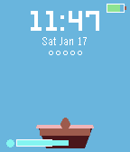
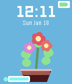
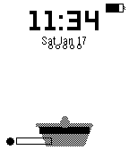
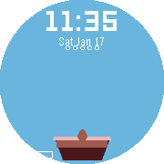

# Pocket Garden

**Grow a virtual plant on your wrist - with wrist exercises!**



## Description

Pocket Garden is an interactive watchface where you nurture a virtual plant throughout the day. Your plant grows from a tiny seed to a beautiful flowering plant - but only if you care for it!

The twist? You water your plant by doing **wrist exercises**. Give your watch a shake, and you'll see water droplets splash onto your plant. It's a fun way to stay active and take micro-breaks during your day.

But be careful - neglect your plant and it will wilt, eventually dying and being reborn as a new seed. Like a phoenix, your garden always gets another chance!

## Features

- **5 Growth Stages**: Seed → Sprout → Small Plant → Full Plant → Flowering
- **Wrist Exercise Watering**: Shake your wrist to water (it's good for you!)
- **Health System**: Water regularly or watch your plant wilt
- **Phoenix Rebirth**: Dead plants are reborn as seeds - start fresh!
- **Persistent State**: Your plant's progress is saved between sessions
- **Battery Aware**: Reduces animations when battery is low
- **Multi-Platform**: Works on all Pebble watches (Aplite, Basalt, Chalk, Diorite)

## Screenshots

| Color (Basalt) | B&W (Aplite) | Round (Chalk) |
|----------------|--------------|---------------|
|  |  |  |

## How to Play

1. **Install** the watchface on your Pebble
2. **Shake your wrist** to water the plant
3. **Watch it grow** through 5 stages over time
4. **Keep it healthy** - water every few hours
5. **Don't neglect it** - or it will wilt and die!

### Water Indicator

| Water Level | Status | Action Needed |
|-------------|--------|---------------|
| 70-100% | Thriving | Plant is happy! |
| 40-70% | Healthy | Doing fine |
| 20-40% | Thirsty | "flex" hint appears |
| 0-20% | Wilting | "FLEX!" blinks urgently |
| 0% | Dead | Reborn as seed |

### Growth Progress

The 5 dots below the date show progress to the next growth stage. Each watering adds progress when your plant is healthy.

## Display Elements

- **Time**: Large digital clock at top
- **Date**: Day and date below time (e.g., "Sat Jan 18")
- **Battery**: Icon at top-right with color coding
- **Growth Dots**: Progress to next stage (hidden at max stage)
- **Water Bar**: Bottom-left with drop icon
- **Flex Hint**: Bottom-right when plant needs water

## Why "Flex"?

We call it "flex" instead of "shake" because watering your plant is actually a mini wrist exercise! Take a micro-break, flex your wrist, and help your plant grow. It's wellness meets virtual pet.

## Technical Details

- **Watering**: Accelerometer tap detection
- **Water Decay**: -12% every 30 minutes
- **Growth Rate**: ~13 waterings per growth stage
- **Persistence**: Plant state saved to watch storage

## Building from Source

```bash
cd pocket-garden
pebble build
pebble install --emulator basalt  # Test in emulator
pebble install --phone IP_ADDRESS  # Install on watch
```

## Store Description

> **Pocket Garden** - Grow a plant with wrist exercises!
>
> Turn micro-breaks into a game. Shake your wrist to water your virtual plant and watch it grow from seed to flower. But don't neglect it - your plant will wilt without regular care!
>
> Features:
> - Shake to water (good for your wrists!)
> - 5 growth stages from seed to flower
> - Plant wilts if neglected, reborn when it dies
> - Shows time, date, and battery
> - Works on all Pebble watches
>
> The perfect watchface for plant lovers and anyone who wants a fun reminder to take breaks and move!

## Credits

Created with the Pebble SDK.

## License

MIT License - Feel free to modify and share!
