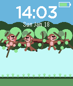
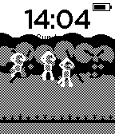

# Tumbling Monkeys

A fun, animated Pebble watchface featuring playful monkeys swinging through the jungle!

## Features

- **3 Animated Monkeys** - Watch them swing on vines, climb, hang upside down, munch apples, and even fight each other!
- **Shake to Tumble** - Shake your watch and the monkeys fall from the trees with haptic feedback!
- **Time & Date** - Clear time display with day and date
- **Battery Indicator** - Color-coded battery level (green/orange/red)
- **Jungle Scene** - Lush canopy, swinging vines, and branches
- **Ultra-Efficient Mode** - Auto FPS cap on B/W and low battery; manual toggle
  - Up button: toggle low-power (FPS cap)
  - Down button: toggle vibrations
  - Animation pauses when charging or Bluetooth is disconnected

## Monkey Tricks

- 🌿 **Vine Swinging** - Tarzan-style swing, release, and catch the next vine
- 🧗 **Climbing** - Climb up and down vines
- 🙃 **Tail Hang** - Hang upside down from branches
- 🍎 **Apple Munching** - Sit on a branch and munch an apple
- 👊 **Fighting** - Monkeys tussle with each other
- 💫 **Falling** - Shake to make them tumble down with dizzy stars!

## Compatibility

| Platform | Display | Status |
|----------|---------|--------|
| Basalt | Color 144x168 | ✅ Supported |
| Aplite | B&W 144x168 | ✅ Supported |
| Chalk | Color 180x180 | ✅ Supported |
| Diorite | Color 144x168 | ✅ Supported |

## Screenshots

### Color (Basalt/Pebble Time)


### Black & White (Aplite/Original Pebble)


## Installation

### From Pebble App Store
Search for "Tumbling Monkeys" in the Pebble app store.

### Manual Installation
```bash
pebble build
pebble install --phone <your-phone-ip>
```

### Emulator Testing
```bash
pebble install --emulator basalt
pebble emu-tap --emulator basalt  # Shake to make monkeys fall!
```

## Build

```bash
pebble build
```

Output: `build/tumbling-monkeys.pbw`

## License

MIT License

## Author

Pebble Watchface Generator

---

*Shake your watch and watch the monkeys tumble!* 🐒
